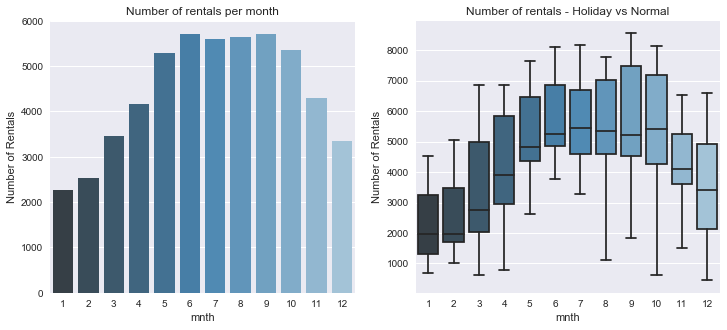
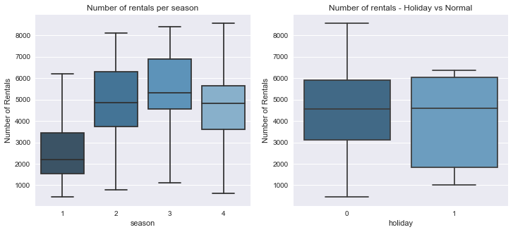
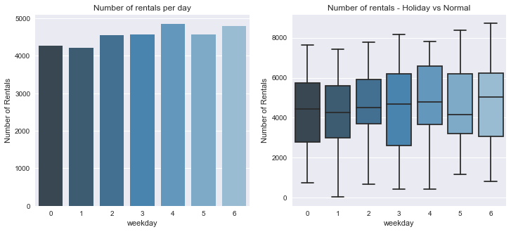
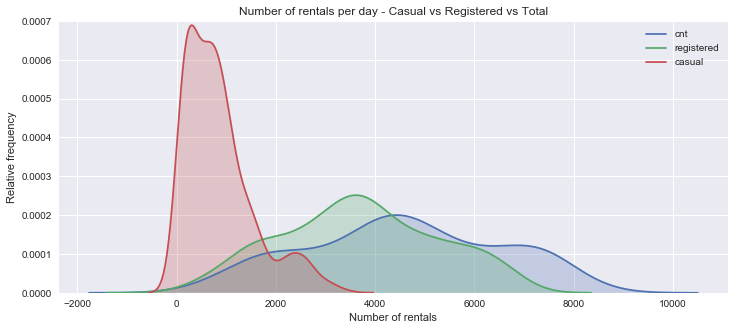
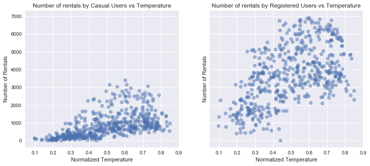
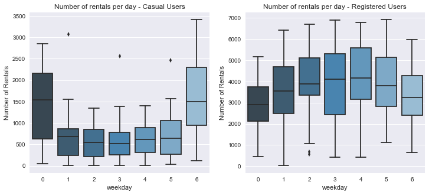
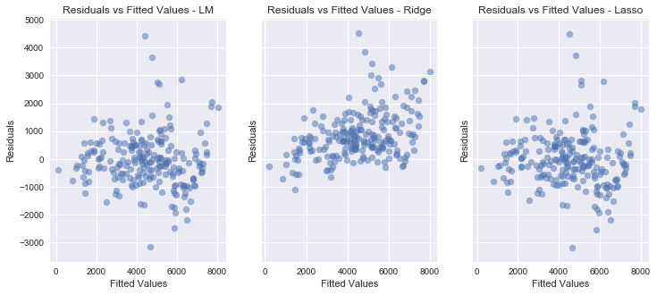

# Bike Rental Analysis and Prediction

A lot of cities around the world are implementing bike rental stations as part of their integrated transport systems. Additional to increasing the available options of moving around the city, these systems bring a lot of positive consequences to urban spaces, like reducing gas emissions, traffic jams and improving the health of citizens. To have a system working, it's essential to have the correct capacity for satisfying the needs of the users. This correct capacity requires continuous maintenance, relocation, and acquisition of new bikes.

The goal of this project is using data available from [Washington DC's bike sharing system](https://secure.capitalbikeshare.com/map/) and some additional information gathered, for predicting the number of bicycles needed per day on some temporal and weather conditions. This type of predictions help the system managers to handle their capacity, program better maintenance times and keep their user rate increasing. 

## Data Download

For this project, I used the data from [Bike Sharing Dataset Data Set](http://archive.ics.uci.edu/ml/datasets/Bike+Sharing+Dataset), which is part of a paper from Fanaee-T, Hadi, and Gama, Joao, called 'Event labeling combining ensemble detectors and background knowledge'. Since the data was in `.zip.` format, I downloaded and put it in the [Data](./data/) folder of this repository.

This dataset has 731 observations and 16 attributes, which 3 of them are response variables. Previous to any analysis, I will split the data and keep the test data apart, respecting the golden rule of machine learning. I decided to work with the `day` dataset, which groups the hourly observations into days.

## Exploratory Data Analysis

The idea with the Exploratory Data Analysis (EDA) is finding some general patterns in the dataset, which will be contrasted with the results of the models. The features are divided into two groups (I used the descriptions  [Dataset Site](http://archive.ics.uci.edu/ml/datasets/Bike+Sharing+Dataset):

- **Weather features**: each observation has the following features computed by the authors and combined with the information from the bike sharing system:

    + weathersit : 
        - 1: Clear, Few clouds, Partly cloudy, Partly cloudy
        - 2: Mist + Cloudy, Mist + Broken clouds, Mist + Few clouds, Mist
        - 3: Light Snow, Light Rain + Thunderstorm + Scattered clouds, Light Rain + Scattered clouds
        - 4: Heavy Rain + Ice Pallets + Thunderstorm + Mist, Snow + Fog
    - temp : Normalized temperature in Celsius.
    - atemp: Normalized feeling temperature in Celsius.
    - hum: Normalized humidity.
    - windspeed: Normalized wind speed. The values are divided into 67 (max)
    

- **Temporal features**: the authors used the following information available from the bike sharing system.

    - instant: record index
    - dteday : date
    - season : season (1:springer, 2:summer, 3:fall, 4:winter)
    - yr : year (0: 2011, 1:2012)
    - mnth : month ( 1 to 12)
    - hr : hour (0 to 23)
    - holiday : weather day is holiday or not (extracted from [Web Link])
    - weekday : day of the week
    - workingday : if day is neither weekend nor holiday is 1, otherwise is 0.
    
    
- **Response variables**:

    - casual: count of casual users
    - registered: count of registered users
    - cnt: count of total rental bikes including both casual and registered

The idea with this EDA is observing the relations between the two groups of features with these response variables.

We can see from the previous plots that the months with the highest number of rentals are from May to September (summer months), and the months with the lowest amount of rentals are the winter months. Even though, some of the summer months like August and September have wide ranges for the rentals per day. Just observing this plot, we can see that the most important months for the system to operate well are May, June, and July, where the minimum number of rentals per day is high.

If we analyze the rentals by season instead of that by month, we can see the same conclusions, summer, and the beginning of fall months are crucial for the operation of the system.

The number of rentals per day is almost constant, with no significant differences in the number of rentals on the different days of the week. Until now we have identified two insights in our data: 

- Summer months are more attractive for using bikes than wet winter months.
- The days of the week have similar renting patterns.

Now we will perform the similar analysis but explore the different types of users, casual and registered.

Almost all the days observed, the number of rentals by registered users was higher than the number of rentals by casual users. The number of rentals by casual users was more constant and centered around their mean, while in the registered users the variance of the number of rentals was higher. We can see both conclusions from the previous plot.

Now, we will compare the other block of features, weather, with the different types of users:

From the previous scatterplots, we can see that the relationship between temperature and the total number of rentals is different depending on the type of user. The casual users, possibly tourists, have a slightly increasing number of rentals when the weather is warmer. On the other hand, registered users are highly influenced by the weather for deciding to rent the bikes. This insight is relevant to the model fitting section because graphically we can say that both groups of users have different patterns.

There are even more differences between Casual and Registered users. From the previous boxplots, we can see that casual users rent their bikes mainly on weekends, while registered users rent them on working days. This tells us more about the difference between both groups. Casual users use the bikes for pleasure, and maybe most of them are tourists. On the other hand registered users use them as a transport system for their daily commute. Even though we don't have information about the users, this data exploration tells us a lot about them. For this reason, in the following section, we need to treat them differently.

For this EDA, I also include some summary tables of the explanatory and response variables:

**Summary of Response Variables**

<table border="1" class="dataframe">
  <thead>
    <tr style="text-align: right;">
      <th></th>
      <th>casual</th>
      <th>registered</th>
      <th>cnt</th>
    </tr>
  </thead>
  <tbody>
    <tr>
      <th>count</th>
      <td>511.000000</td>
      <td>511.000000</td>
      <td>511.000000</td>
    </tr>
    <tr>
      <th>mean</th>
      <td>860.168297</td>
      <td>3697.608611</td>
      <td>4557.776908</td>
    </tr>
    <tr>
      <th>std</th>
      <td>695.752711</td>
      <td>1572.964501</td>
      <td>1957.390025</td>
    </tr>
    <tr>
      <th>min</th>
      <td>2.000000</td>
      <td>20.000000</td>
      <td>22.000000</td>
    </tr>
    <tr>
      <th>25%</th>
      <td>315.500000</td>
      <td>2547.000000</td>
      <td>3178.500000</td>
    </tr>
    <tr>
      <th>50%</th>
      <td>699.000000</td>
      <td>3656.000000</td>
      <td>4509.000000</td>
    </tr>
    <tr>
      <th>75%</th>
      <td>1133.000000</td>
      <td>4861.000000</td>
      <td>6146.500000</td>
    </tr>
    <tr>
      <th>max</th>
      <td>3410.000000</td>
      <td>6917.000000</td>
      <td>8714.000000</td>
    </tr>
  </tbody>
</table>

**Summary of Response Variables**

<table border="1" class="dataframe">
  <thead>
    <tr style="text-align: right;">
      <th></th>
      <th>atemp</th>
      <th>hum</th>
      <th>temp</th>
      <th>windspeed</th>
    </tr>
  </thead>
  <tbody>
    <tr>
      <th>count</th>
      <td>511.000000</td>
      <td>511.000000</td>
      <td>511.000000</td>
      <td>511.000000</td>
    </tr>
    <tr>
      <th>mean</th>
      <td>0.477504</td>
      <td>0.625971</td>
      <td>0.499712</td>
      <td>0.194059</td>
    </tr>
    <tr>
      <th>std</th>
      <td>0.163563</td>
      <td>0.139422</td>
      <td>0.183431</td>
      <td>0.076553</td>
    </tr>
    <tr>
      <th>min</th>
      <td>0.098839</td>
      <td>0.187917</td>
      <td>0.096522</td>
      <td>0.022392</td>
    </tr>
    <tr>
      <th>25%</th>
      <td>0.336245</td>
      <td>0.519583</td>
      <td>0.336250</td>
      <td>0.140550</td>
    </tr>
    <tr>
      <th>50%</th>
      <td>0.497463</td>
      <td>0.623750</td>
      <td>0.511667</td>
      <td>0.184092</td>
    </tr>
    <tr>
      <th>75%</th>
      <td>0.615233</td>
      <td>0.728541</td>
      <td>0.660416</td>
      <td>0.236937</td>
    </tr>
    <tr>
      <th>max</th>
      <td>0.840896</td>
      <td>0.972500</td>
      <td>0.849167</td>
      <td>0.507463</td>
    </tr>
  </tbody>
</table>

## Feature and Model Selection

Since the response variables in this data are numerical, the models used for explaining and predicting them should be part of the *regression* group. I will use for each user group a linear regression model without regularization, a Ridge Regression, a Lasso regression and a Random Forest Regressor.

### All Users

| Item  | Linear Regression  | Ridge  | Lasso  | Random Forest Regressor |
|:-:|:-:|:-:|:-:|:-:|
| Training Score  | 0.81  | 0.81  | 0.81  | 0.97 |
| Validation Score  | 0.76  | 0.76  | 0.76  | 0.86 |
| Non-zero coefficients  | 11  | 11  | 11  | NA |

There was no significant difference between the results with the simple linear regression model and the regularized methods. Random forest outperformed the other ones. 

In the following plot, we can see how the residuals are distributed for the three linear regression models. From the plot, we can see that they are almost homoscedastic with some exceptions in some regions.

### Registered Users

| Item  | Linear Regression  | Ridge  | Lasso  | Random Forest Regressor |
|:-:|:-:|:-:|:-:|:-:|
| Training Score  | 0.83  | 0.82  | 0.82  | 0.97 |
| Validation Score  | 0.79  | 0.79  | 0.79  | 0.83 |
| Non-zero coefficients  | 11  | 11  | 11  | NA |

### Casual Users
| Item  | Linear Regression  | Ridge  | Lasso  | Random Forest Regressor |
|:-:|:-:|:-:|:-:|:-:|
| Training Score  | 0.69  | 0.69  | 0.69  | 0.96 |
| Validation Score  | 0.67  | 0.67  | 0.67  | 0.82 |
| Non-zero coefficients  | 11  | 11  | 11  | NA |

## Conclusions

- The features on this dataset were relevant for predicting the different responses. The L1 and L2 regularization methods with `Ridge` and `Lasso` didn't improve the accuracy compared to the basic `Linear Regression`. One possible explanation for this is that the authors of the dataset already performed a feature selection process on the raw data.

- There was minimal difference in the accuracy levels between the linear regression models with and without regularization. In all of them, the R squared was over 76% predicting total users per day. This means that this model can explain 76% of the variations in the rentals per day in the Washington bike sharing system with the weather and transactional history.

- The random forest regressor outperforms the rest of the methods. This proves that ensemble methods are powerful. They give us a higher accuracy in exchange for interpretability.

- Even though we found differences in the EDA in the usage profiles between Registered and Casual users when we fit models for each one the accuracy decreases. This is explained because we are adding a new subset in our prediction, but our original data is not changing. We need to have more levels of detail in our data for getting more accurate with the predictions by type of user.

